# Final-Project-PROGDAS
Program yang akan dibuat adalah program yang terdiri dari 2 fitur yaitu Kalkulator Penggunaan Air dan Survei/Kuesioner Mandiri untuk menguji kelayakan air hal ini sejalan
dengan SDG nomor 6 "Sanitasi dan air bersih".

## Anggota Kelompok 9 (Rust) :
|NPM       |Nama                  |Username GITHUB      |
|----------|----------------------|---------------------|
|2406353723|Ferdyano              |Ferdyano01           |
|2406420892|Mohamad Rizky Alamsyah|cosmicdust00         |	
|2406416024|Nabil Putra Nurfariz  |Naputriz             |	
|2406401294|Novan Agung Wicaksono |Jack-of-all-trades-04|

## Rubrik Penilaian

## Ketentuan
Submission is through EMAS with the following file:
1. Final Program with a .c extension. If separate header files exist, all programs must be
zipped into one file.
2. Program executable file (.exe).
3. A Github link (URL is written inside the report). It should be clear who did what
4. Video presentation in Youtube, unlisted. The explation should follow the order of the rubric
(see Section III). Duration: 5 – 8 minutes (URL is written inside the report).
5. A report in PDF format. Generally, the report should use font Arial 11 pt, single space, no
space before & after paragraph, except the flowchart and source code. The report should
include all of this elements:
- Pg 1: Cover
- Pg 2: Video presentation URL & Github URL
- Pg 3: Task division for each group member written in detail & the username in github.
Everyone should have clear contribution in making the program, i.e. which block, shich
function.
- Pg 4: A brief explanation of the program's theme (no more than 1 page)
- Pg 5 etc: List of variables, arrays, structs, etc., and their uses.
- List of functions and their uses.
- Main program Flowchart. Arial narrow, 9 pt
- Each function flowchart. Arial narrow, 9 pt
- A copy of the source code with the following specifications: font: Lucida Console, 10pt,
single space, no space before or after paragraphs, etc.
- Screen capture of the running program (not the code), for all cases.

## Ringkasan Data Variabel
### 1. Variabel Kuesioner Mandiri (Survei Kelayakan Air)

| Kategori           | Variabel                          | Skala / Batas Ideal                                   | Sumber & Catatan                                         |
|--------------------|-----------------------------------|--------------------------------------------------------|----------------------------------------------------------|
| **Sensorik / Fisik** | pH                                | 6.5 – 8.5                                               | Sesuai WHO & Permenkes RI                            |
|                    | Kekeruhan (Turbidity)             | ≤ 5 NTU (ideal < 1 NTU)                                | WHO: untuk small supplies ≤ 5 NTU                        |
|                    | Warna (True Colour)               | ≤ 50 TCU                                               | Permenkes RI                                            |
|                    | Bau                               | Skala 0 (tidak berbau) – 5 (sangat menyengat)          | Definisi umum air bersih                                 |
|                    | Rasa                              | Skala 0 (tawar) – 5 (sangat pahit/logam)               | Definisi umum air bersih                                 |
| **Endapan & Padatan** | TDS (Total Dissolved Solids)     | ≤ 1000 mg/L                                            | Permenkes RI                                          |
|                    | Endapan setelah didiamkan         | Skala 0 (tidak ada) – 5 (banyak)                       | —                                                        |
| **Mikrobiologi**     | Total coliform                    | 0–50 CFU/100 mL                                        | Permenkes RI                                          |
|                    | Escherichia coli (E. coli)        | 0 CFU/100 mL                                           | WHO & Permenkes RI                                       |

### 2. Variabel Kalkulator Penggunaan Air Domestik
| Aktivitas               | Variabel & Unit        | Faktor Konversi ke Liter         | Batas & Kategori WHO          |
|------------------------|------------------------|----------------------------------|-------------------------------|
| Minum                  | `air_minum` (L/hari)    | langsung input                   | Ideal 2–3 L/hari              |
| Mandi                  | `mandi` (# kali/hari)   | × 35 L per kali                  | —                             |
| Cuci piring            | `cuci_piring` (#/hari)  | × 10 L per kali                  | —                             |
| Cuci baju              | `cuci_baju` (#/minggu)  | × 60 L per kali ÷ 7 hari         | —                             |
| Wudhu / Cuci tangan    | `wudhu` (#/hari)        | × 3 L per kali                   | —                             |
| Siram tanaman          | `siram_tanaman` (L)     | langsung input                   | —                             |
| Lain-lain (toilet, dsb)| `lain_lain` (L/hari)    | estimasi / langsung input        | —                             |

**Total penggunaan per hari = jumlah semua aktivitas.**

Bandingkan dengan pedoman WHO 50–100 L/orang/hari:
- `< 50 L → “Perlu Perhatian Kebersihan”`
- `50–100 L → “Ideal”`
- `> 100 L → “Boros”`

## Job Desc
- Novan : Kumpulin Data Referensi, Membuat framework template dan Membuat Fungsi Survei Dasar
- Nabil : Menyempurnakan Fungsi Survei dan Memperbaiki Penilaian Survei
- Ferdy : Menambahkan fitur pada program, Debugging code dan Masukkan pada framework template
- Alam  : Menyempurnakan Fungsi Kalkulator dan Debugging Code

## Workflow Program

```mermaid
---
config:
  layout: elk
  theme: neo
  look: neo
---
flowchart TD
 subgraph subGraph0["Main Menu"]
        B1[/"Tampilkan Menu"/]
        A["Start"]
        B2[/"Input Pilihan User 1-3"/]
        B3{"Input Valid?"}
        C1{"Pilihan == 1?"}
        D1[/"Survei Mandiri"/]
        C2{"Pilihan == 2?"}
        X1[/"Kalkulator Air"/]
        Z{"Pilihan == 3?"}
        X[/"Program Selesai"/]
  end
 subgraph subGraph1["Survei Mandiri"]
        D2[/"Input BAU 1-5"/]
        D2a{"Valid?"}
        D3[/"Punya alat NTU/TCU? Y/N"/]
        D3a{"Punya?"}
        D7[/"Input KOTOR 1-5"/]
        D4[/"Input NTU > 0"/]
        D4a{"Valid?"}
        D5[/"Input TCU > 0"/]
        D5a{"Valid?"}
        D7a{"Valid?"}
        D8[/"Punya alat pH? Y/N"/]
        D8a{"Punya?"}
        D11[/"Input RASA 1-5"/]
        D9[/"Input pH 0-14"/]
        D9a{"Valid?"}
        D12[/"Input ENDAPAN 1-5"/]
        D11a{"Valid?"}
        D12a{"Valid?"}
        D13[/"Punya alat eColi? Y/N"/]
        D13a{"Punya?"}
        D16[/"Input DIARE 1-5"/]
        D14[/"Input eColi > 0"/]
        D14a{"Valid?"}
        E1[/"Hitung Skor Total"/]
        D16a{"Valid?"}
        E2{"Skor &lt; 50"}
        E3[/"Status: Tidak Layak"/]
        E4{"Skor &lt; 70"}
        E5[/"Status: Hati-hati"/]
        E6{"Skor &lt; 85"}
        E7[/"Status: Layak"/]
        E8[/"Status: Sangat Layak"/]
        E9[/"Hitung Akurasi Alat"/]
  end
 subgraph subGraph2["Kalkulator Air"]
        X2[/"Input jumlah anggota > 0"/]
        X2a{"Valid?"}
        X3[/"Isi 6 pertanyaan per anggota"/]
        X4[/"Hitung total liter keluarga"/]
        X5[/"Hitung rata-rata penggunaan"/]
        X6{"Rata-rata &lt; 50"}
        X7[/"Kategori: KURANG"/]
        X8{"Rata-rata &lt;= 100"}
        X9[/"Kategori: IDEAL + dapat badge"/]
        X10[/"Kategori: BOROS"/]
        X11[/"Ingin saran? Y/N"/]
        X11a{"Valid?"}
        X12[/"Tampilkan 3 saran"/]
  end
    A --> B1
    B1 --> B2
    B2 --> B3
    B3 -- Tidak --> B1
    B3 -- Ya --> C1
    C1 -- Ya --> D1
    C1 -- Tidak --> C2
    C2 -- Ya --> X1
    C2 -- Tidak --> Z
    Z -- Ya --> X
    Z -- Tidak --> B1
    D1 --> D2
    D2 --> D2a
    D2a -- Tidak --> D2
    D2a --> D3
    D3 --> D3a
    D3a -- Tidak --> D7
    D3a -- Ya --> D4
    D4 --> D4a
    D4a -- Tidak --> D4
    D4a --> D5
    D5 --> D5a
    D5a -- Tidak --> D5
    D5a --> D7
    D7 --> D7a
    D7a -- Tidak --> D7
    D7a --> D8
    D8 --> D8a
    D8a -- Tidak --> D11
    D8a -- Ya --> D9
    D9 --> D9a
    D9a -- Tidak --> D9
    D9a --> D12
    D11 --> D11a
    D11a -- Tidak --> D11
    D11a --> D12
    D12 --> D12a
    D12a -- Tidak --> D12
    D12a --> D13
    D13 --> D13a
    D13a -- Tidak --> D16
    D13a -- Ya --> D14
    D14 --> D14a
    D14a -- Tidak --> D14
    D14a --> E1
    D16 --> D16a
    D16a -- Tidak --> D16
    D16a --> E1
    E1 --> E2
    E2 -- Ya --> E3
    E2 -- Tidak --> E4
    E4 -- Ya --> E5
    E4 -- Tidak --> E6
    E6 -- Ya --> E7
    E6 -- Tidak --> E8
    E3 --> E9
    E5 --> E9
    E7 --> E9
    E8 --> E9
    E9 --> B1
    X1 --> X2
    X2 --> X2a
    X2a -- Tidak --> X2
    X2a --> X3
    X3 --> X4
    X4 --> X5
    X5 --> X6
    X6 -- Ya --> X7
    X6 -- Tidak --> X8
    X8 -- Ya --> X9
    X8 -- Tidak --> X10
    X10 --> X11
    X11 --> X11a
    X11a -- Tidak --> X11 & B1
    X11a -- Ya --> X12
    X7 --> B1
    X9 --> B1
    X12 --> B1
```

## Penjelasan Workflow program
1. Program menghitung penggunaan air dalam kehidupan sehari-hari meliputi kegiatan berikut ini:
- minum
- mandi
- mencuci piring
- mencuci baju
- ibadah
- menyiram tanaman
- dan kegiatan lainnya

2.Program menentukan kelayakan air meliput beberapa indeks sebagai berikut:
- PH air
- Warna air
- kekeruhan air
- Bau air
- Rasa air
- Jumlah coliform
- Nilai endapan

Flow program untuk kelayakan air
- Tanya User untuk memilih di antara 2 opsi yaitu kelayakan air atau penggunaan air
- Pilihan pertama akan bertanya tentang kelayakan air
- Apabila user memilih pilihan 1, maka mendapat pertanyaan tentang PH air berupa kadar PH kurang dari 6.5 atau lebih dari 8.5
- Bila memenuhi salah satu maka skor kelayakan air bertambah 5
- Lalu, user akan mendapatkan pertanyaan tentang nilai kekeruhan air, bila lebih dari 5 maka skor kelayakan air bertambah 5
- Kemudian, user akan mendapatkan pertanyaan tentang skor bau dari air, nilai skor kelayakan air akan bertambah sesuai dengan nilai bau    dari air
- Selanjutnya, user akan mendapatkan pertanyaan tentang rasa dari air, nilai skor kelayakan air akan bertambah sesuai dengan nilai rasa   dari air
- Setelah itu, user akan mendapatkan pertanyaan tentang skor endapan air, nilai skor kelayakan air akan bertambah sesuai dengan nilai endapan dari air
- Terakhir, user akan mendapatkan pertanyaan tentang jumlah bakteri, bila jumlah bakteri lebih dari 50 maka skor kelayakan air akan bertambah 5

flow program untuk penggunaan air
- Tanya user konsumsi air minum untuk satu hari lalu total penggunaan air akan bertambah
- Lalu user akan ditanya tentang konsumsi air untuk mandi kemudian akan membuat total penggunaan air ditambah sebelumnya
- Kemudian user akan mendapat pertanyaan penggunaan air untuk mencuci piring lalu membuat total penggunaan air ditambah sebelumnya
- Selanjutnya user akan ditanya tentang penggunaan air untuk mencuci baju kemudian akan ditambah total penggunaan air sebelumnya
- Setelah itu user juga mendapat pertanyaan penggunaan air untuk ibadah dan menyiram tanaman hingga mendapat total penggunaan air satu hari
- Saat user telah memasukkan semua penggunaan air dalam satu hari maka akan menampilkan totoal penggunaan air selama satu hari
- Penggunaan air selama satu hari akan dikelompokkan menjadi tiga jenis yaitu kurang, ideal, dan boros
- Apabila penggunaan air boros maka user bisa mendapatkan saran untuk menghemat air
- User yang tidak memilih pilihan saran maka membuat program menghitung air selesai
